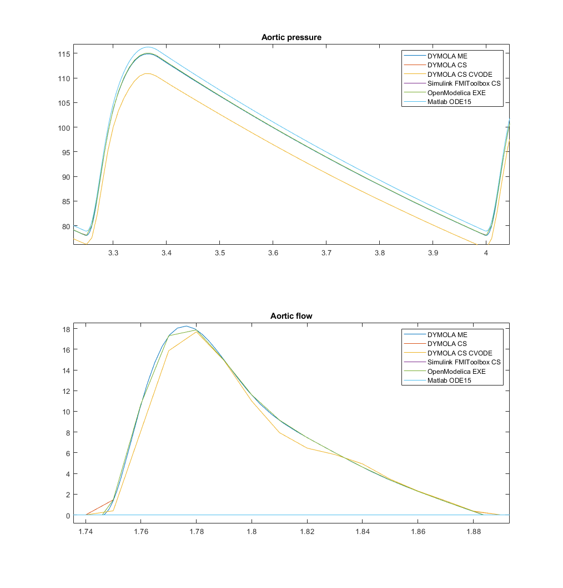
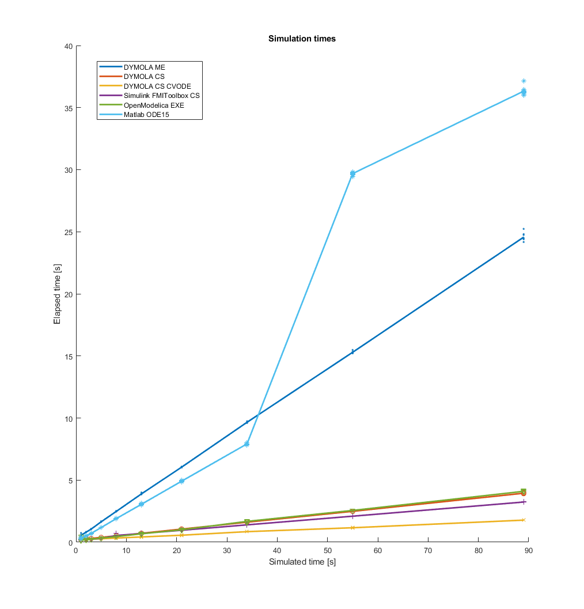

### Performance comparison of FMU vs Matlab

Model by Smith [[1]](https://paperpile.com/c/hguHyv/kgeDp), implemented in Modelica by [[2]](https://paperpile.com/c/hguHyv/jKcS7), source code available at [[3]](https://paperpile.com/c/hguHyv/OQPNX), model name Cardiovascular.Model.Smith2004.HemodynamicsSmith_shallow has been simulated using several methods and compared to Matlab implementation by Brian Carlson.

*   using Modelon FMIToolbox code
    *   Export FMI2 from Dymola
        *   Model exchange (ME) not containing solvers - takes longest time. Not recommended.
        *   Co-simulation (CS) using Dymola solvers - performs probably the best
        *   Co-simulation (CS) using CVODE solvers - the Dymola 2019 suffers from a CVODE related bug. Should be fixed in FD01
    *   Export from OpenModelica, 
        *   FMI1 ME - provides rubbish output
        *   FMI2 ME - does not work
        *   FMI2 CS - crashes matlab (2018a)
*   using Modelon FMIToolbox Simulink
    *   Export FMI2 from Dymola
        *   CS - provides similar results as CS through code. The fastest solution!
    *   Export from OpenModelica
        *   Not being able to run simulation
*   Load into Simulink's own FMIBlock
    *   Export FMI2 from Dymola
        *   Strange error: \
Value type mismatch for parameter 'aorta' in 'SmithCS/FMU'. \
Caused by: \
Value type does not match the structure of variable 'aorta' defined in the modelDescription.xml file. \
Component:Simulink | Category:Block error
    *   Export from OpenModelica
        *   no combination of FMI export proved working
*   OpenModelica exe simulator - the performance is somewhat lower than Dymola CS FMIs, but still acceptable.
*   Matlab - reference implementation by Brian Carlson

The working solutions are presented in figures below. The tests were run at reference machine with i7-3610QM 2.3Ghz with 32GB RAM on windows 10, with matlab 2018a, Dymola 2019 and OpenModelica 1.12. The model has been run in Matlab for {1, 2, 3, 5, 8, 13, 21, 34, 55, 89} seconds and the the elapsed time has been measured. Each measurement has been repeated 10x. The measurement could be repeated using _FMUs.m_. All required sources are made public at 

Figure 1: Comparison of output - The matlab solution provides slightly different, yet still acceptable result, probably caused by different numerics and /or unknown parametrization mismatch. All Modelica based results behave the same, except for Dymola CVODE, which suffers from a known bug in Dymola 2019 (waiting for a fix in the following version)

Figure 2: Simulation time required per simulated time. Each method and simulation time is run 10x and averaged. The vector-format figure _SimulationTimes.fig_ might be downloaded from [[4]](https://paperpile.com/c/hguHyv/NMiN).

# References

    1. 	[Smith BW, Chase JG, Nokes RI, Shaw GM, Wake G. Minimal haemodynamic system model including ventricular interaction and valve dynamics. Med Eng Phys. Elsevier; 2004;26: 131–139. doi:10.1016/j.medengphy.2003.10.001](http://paperpile.com/b/hguHyv/kgeDp)

    2. 	[Ježek F, Kulhánek T, Kalecký K, Kofránek J. Lumped models of the cardiovascular system of various complexity. Biocybernetics and Biomedical Engineering. 2017;37: 666–678. doi:10.1016/j.bbe.2017.08.001](http://paperpile.com/b/hguHyv/jKcS7)

    3. 	[Ježek F. Physiolibrary.models. In: GitHub [Internet]. [cited 20 Jul 2017]. Available: https://github.com/filip-jezek/Physiolibrary.models](http://paperpile.com/b/hguHyv/OQPNX)

    4. 	[Ježek F. FMIComparison [Internet]. Github; Available: https://github.com/filip-jezek/FMIComparison](http://paperpile.com/b/hguHyv/NMiN)

<!-- GD2md-html version 1.0β13 -->
